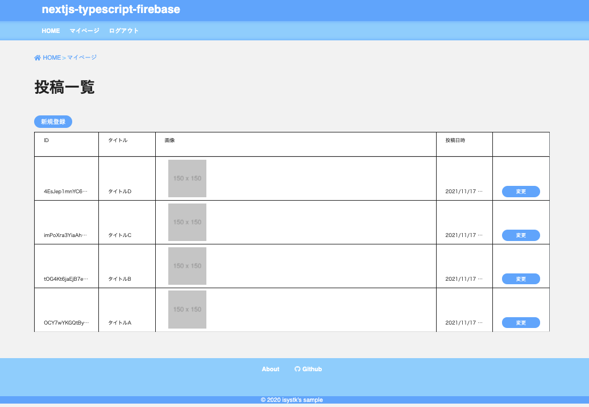
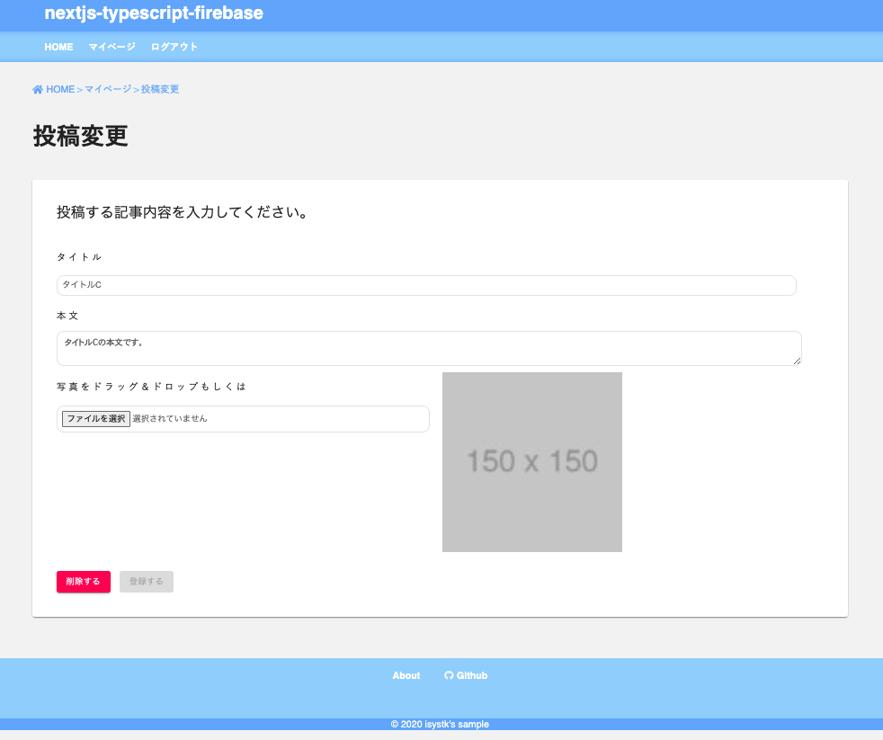

🌙 nextjs-typescript-aws
====

[](https://circleci.com/gh/isystk/nextjs-typescript-aws/tree/master)


## 📗 プロジェクトの概要

Next.js ＆ AWS の学習用サンプルアプリケーションです。


## 🌐 Demo




- ログイン/ログアウト
- 会員登録
- 投稿一覧
- 投稿詳細
- マイページ（一覧・登録・更新・削除）


## 📦 ディレクトリ構造

```
.
├── public/
├── src/ (Next.js のソースコード)
│   ├── auth/
│   ├── common/
│   ├── components/
│   ├── pages/
│   ├── store/
│   ├── styles/
│   └── utilities/
└── test/
```

## 💬 使い方

```
yarn
yarn dev
```

## 🎨 参考

| プロジェクト| 概要|
| :---------------------------------------| :-------------------------------|
| [react-bootstrap](https://react-bootstrap.github.io/components/)| BootstrapのReact用コンポーネント |


## 🎫 Licence

[MIT](https://github.com/isystk/nextjs-typescript-aws/blob/master/LICENSE)

## 👀 Author

[isystk](https://github.com/isystk)

